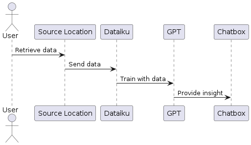

# DeSci-Block: Transforming the Way Researchers Interact with Data

Welcome to **DeSci-Block**, a groundbreaking scientific tool designed to revolutionize the way researchers interact with their data. This innovative platform leverages the power of chatbots, enabling scientists to communicate with their data seamlessly and intuitively.

At the heart of DeSci-Block, we have incorporated **Oort**, a decentralized storage system, and **DBDAO**, a robust platform that allows for the creation of complex structures that can be integrated into a data warehouse component. This sophisticated storage and structuring system ensures that your data is not only securely stored, but also organized in a manner that best suits your scientific needs.

To orchestrate the process, we rely on **Dataiku**, a cutting-edge data science platform that acts as the bridge connecting DBDAO and/or Oort data. Dataiku's primary role is to fit these datasets into the most suitable language model (LLM), tailored to the specific use case of the researcher's problem.

Last but not least, DeSci-Block's user-friendly interface is powered by **Near BOS**. As the front end of our platform, Near BOS allows for an intuitive and interactive user experience, making data management and analysis more accessible than ever.

DeSci-Block is not just a tool, it's a new way to experience, understand, and unlock the potential of your data. Join us on this exciting journey to redefine the boundaries of scientific research and data interaction!

## Arch Diagram

## Oort Decentralized Storage System (DSS)

**Oort DSS** forms the backbone of DeSci-Block's data management capabilities. As a decentralized storage system, Oort DSS is primarily designed to handle unstructured data types, positioning it as a data lake for the most diverse and complex data sets.

Unstructured data refers to information that doesn't reside in a traditional row-column database. It is characterized by its lack of structure and includes formats like images, videos, social media posts, satellite imagery, surveillance footage, geospatial data, and raw survey responses among others.

The strength of Oort DSS lies in its ability to ingest, store, manage, and process these varied data types. This flexibility makes it an invaluable asset in today's data-driven world, where the majority of the data generated is unstructured.

### Key Applications Across Industries

Oort DSS's capacity to handle unstructured data opens up a plethora of possibilities across numerous industries. Here are just a few examples:

- **Healthcare**: Medical imaging data, patient notes, digital health records, genetic sequence data, and biomedical research findings can be stored and analyzed to advance patient care and medical research.

- **Manufacturing**: Quality control images, machine logs, sensor data, and product specifications can be utilized to optimize production processes and improve product quality.

- **Retail**: Customer reviews, social media sentiment, clickstream data, and product images can be harnessed to enhance customer experience, forecast trends, and tailor marketing strategies.

- **Transportation and Logistics**: Real-time GPS tracking data, warehouse management data, shipment documents, and customer feedback can be used to streamline operations and improve efficiency.

- **Environmental Research**: Satellite imagery, climate data, soil samples, and biodiversity studies can be leveraged for environmental conservation and climate change research.

By integrating Oort DSS into DeSci-Block, we are providing researchers and businesses with a robust and flexible tool to handle the ever-growing volume and complexity of data in today's digital world.

## DBDAO: Collaborative Framework for DeSci Projects

**DBDAO** is an integral part of the DeSci-Block ecosystem. Acting as a platform for the creation of structured data systems, DBDAO enhances the collaborative aspect of DeSci projects by offering a unified and structured interface for data management.

At the heart of DBDAO is the ability to build structures that can be integrated into a data warehouse component. This facilitates the construction of organized, logical, and structured data representations that make collaborative work on complex scientific projects easier and more efficient.

### Enhancing Collaboration with DBDAO

The collaborative benefits of DBDAO manifest in several ways:

- **Unified Data View**: DBDAO provides a unified view of the data, making it easier for collaborators to understand the structure and context of the data without having to navigate through disparate and disjointed data sources.

- **Data Accessibility**: With DBDAO, collaborators can easily access and manipulate data, regardless of their location. This makes DBDAO an ideal tool for distributed teams working remotely on the same project.

- **Data Consistency**: DBDAO ensures data consistency across the board. This means that all collaborators are working with the same version of the data, eliminating discrepancies and reducing confusion.

- **Efficient Communication**: DBDAO's structured data representation makes it easier for team members to communicate about the data. This clarity can significantly streamline the problem-solving process in complex scientific projects.

By integrating DBDAO into DeSci-Block, we are setting the stage for a more seamless, efficient, and productive collaborative experience in scientific research. DBDAO not only simplifies data management but also facilitates clear and effective collaboration, making it an invaluable tool for any DeSci project.

## NEAR BOS: The Gateway to DeSci-Block

**NEAR BOS** forms the front-end interface for DeSci-Block, offering an intuitive and interactive user experience that makes navigating and managing complex scientific data a breeze. As the primary point of interaction between users and the DeSci-Block platform, NEAR BOS has been designed with a focus on usability, flexibility, and adaptability.

### Implementation and Features

NEAR BOS has been implemented using the latest front-end technologies, ensuring a responsive, efficient, and engaging user experience. The interface is clean and user-friendly, enabling users to easily navigate through the system and carry out their tasks. 

Here are some of the features that make NEAR BOS an ideal front-end interface for DeSci-Block:

- **User-Centered Design**: NEAR BOS has been designed with the user at the forefront. The interface is intuitive and easy to understand, reducing the learning curve and allowing users to get up to speed quickly.

- **Interactive Data Visualization**: NEAR BOS includes powerful data visualization tools. This allows users to interact with their data in a visual and intuitive way, aiding in understanding and decision-making processes.

- **Real-Time Updates**: NEAR BOS offers real-time updates, ensuring that users always have access to the most recent data and changes.

- **Adaptability**: NEAR BOS can easily be adapted to the specific needs and preferences of the user, offering a personalized and efficient user experience.

By implementing NEAR BOS as the front-end interface, DeSci-Block enables researchers and other users to interact with their data and the DeSci-Block platform in an accessible and engaging manner. This ultimately contributes to making scientific data management and analysis more efficient and enjoyable.

# Roadmap

Our primary focus over the 4-week period of the Psi Combinator program is to implement the chatbot component of DeSci-Block using ChatGPT. The following is a week-by-week breakdown of our goals and milestones:

## Week 1: Planning and Design

- Understand the specific requirements and goals of the chatbot component.
- Design the interaction flow and capabilities of the chatbot.
- Identify and prepare the necessary data for training and fine-tuning the chatbot.

## Week 2: Initial Implementation

- Set up the basic infrastructure for the chatbot, including the integration with ChatGPT.
- Begin the process of training and fine-tuning the chatbot based on the prepared data.
- Implement the basic interaction flow of the chatbot.

## Week 3: Iteration and Improvement

- Test the chatbot's performance and identify areas for improvement.
- Refine and improve the chatbot's interaction flow and capabilities based on feedback and testing.
- Continue training and fine-tuning the chatbot.

## Week 4: Finalization and Integration

- Perform final tests and refinements of the chatbot.
- Integrate the chatbot with the rest of the DeSci-Block platform.
- Prepare documentation and demos for the chatbot component.

By the end of the 4-week period, we aim to have a fully
